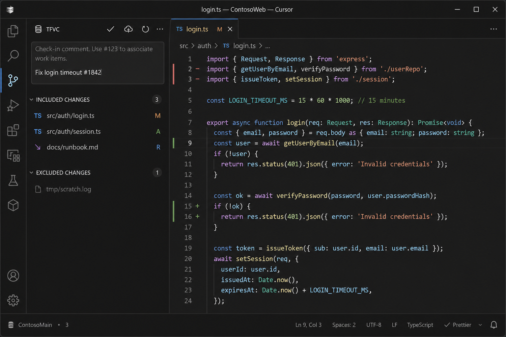
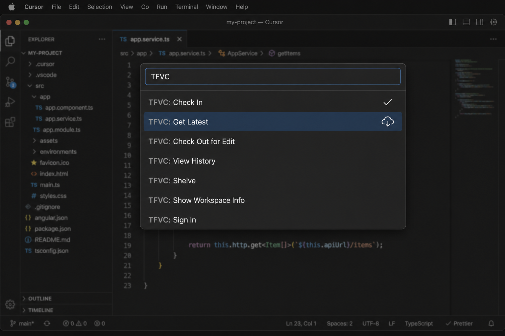
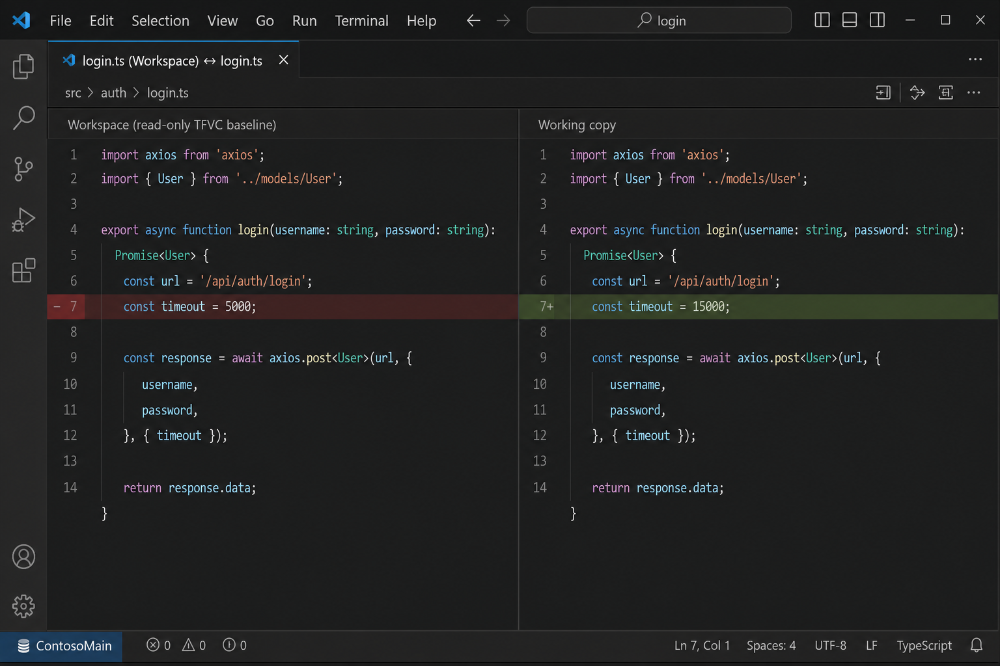

# TFVC for Cursor and VS Code

Use **Team Foundation Version Control** from Cursor or VS Code. The extension talks to `tf.exe` (Visual Studio) or the Team Explorer Everywhere `tf` CLI and plugs into the built-in Source Control view.

Cursor is a VS Code-compatible editor, so this is a normal VS Code extension: same APIs, same VSIX, same Source Control UI. Install it in Cursor the same way you install any other VSIX.

<p align="center">
  
</p>

<p align="center"><em>Pending changes, check-in comment, and workspace status in Cursor.</em></p>

## Install in Cursor

1. Download the latest `.vsix` from [Releases](https://github.com/rexfordmachu/vscode-tfvc/releases), or build one locally (`npm run package`).
2. In Cursor: **Extensions** → `⋯` → **Install from VSIX…**
3. Open a folder that is already mapped with `tf workfold`.
4. Open the **Source Control** view. If TFVC does not appear, run **TFVC: Choose tf.exe Path**.

You can also press **F5** in this repo to launch an Extension Development Host and try it without installing.

VS Code install is identical (**Extensions** → `⋯` → **Install from VSIX…**).

## Screenshots

### Command Palette



Every command lives under the **TFVC** category. The Source Control title bar also exposes Check In, Get Latest, and Refresh.

### Diff against the workspace version



Click a pending change, or run **TFVC: Compare with Workspace Version**. Editor gutters show a quick-diff against `tf view`.

## What it does

- Source Control view with **included**, **excluded**, and **conflicted** pending changes
- **Check in** from the SCM input box (`Ctrl+Enter` / `Cmd+Enter`). `#123` in the comment associates work items when using TEE CLC
- Get latest, checkout, add, undo, delete, rename
- History, shelve / unshelve, keep-yours / take-theirs resolve
- Auto-checkout of read-only files when you start typing (server workspaces)
- Explorer and editor context menus
- Output channel that logs every `tf` invocation (passwords redacted)

This project is not affiliated with Microsoft. Microsoft’s Azure Repos VS Code extension no longer ships TFVC; this is a standalone `tf` client wrapper.

## Requirements

You need a TF command-line client and a folder mapped with `tf workfold`.

| Platform | Client | Typical location |
| --- | --- | --- |
| Windows | Visual Studio `tf.exe` | `Microsoft Visual Studio\2022\<edition>\Common7\IDE\CommonExtensions\Microsoft\TeamFoundation\Team Explorer\TF.exe` |
| macOS / Linux | Team Explorer Everywhere CLC (`tf`) | on `PATH`, or set `tfvc.path` |

The extension auto-detects Visual Studio installs (including `vswhere`) and `tf` on `PATH`.

## Settings

| Setting | Default | Meaning |
| --- | --- | --- |
| `tfvc.path` | _(auto)_ | Absolute path to `tf.exe` or `tf` |
| `tfvc.collection` | | Optional `/collection` URL |
| `tfvc.login` | | Username for `/login`. Store the password with **TFVC: Sign In** (Secret Storage, not settings.json) |
| `tfvc.autoCheckout` | `true` | Check out read-only files on first edit |
| `tfvc.restrictToWorkspaceFolder` | `true` | Limit status/get to the opened folder |
| `tfvc.refreshOnSave` | `true` | Refresh pending changes after save |

## Develop

```bash
npm install
npm test
```

Press **F5** and choose **Run TFVC Extension**. Parser tests do not need `tf.exe`.

```bash
npm run package   # writes tfvc-0.1.0.vsix
```

## License

[MIT](LICENSE)
